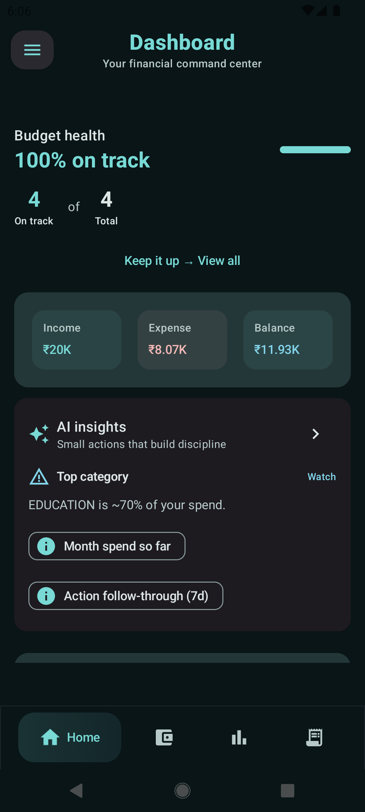
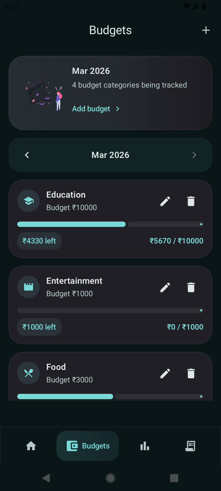
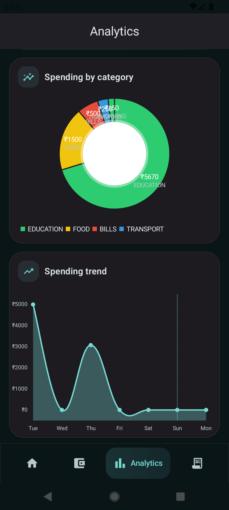
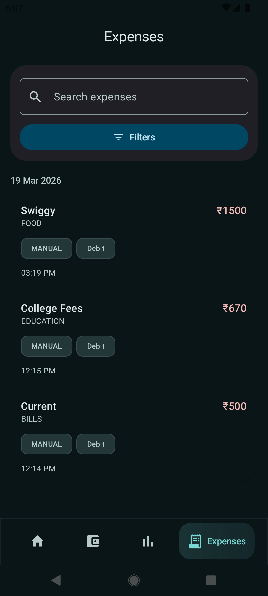
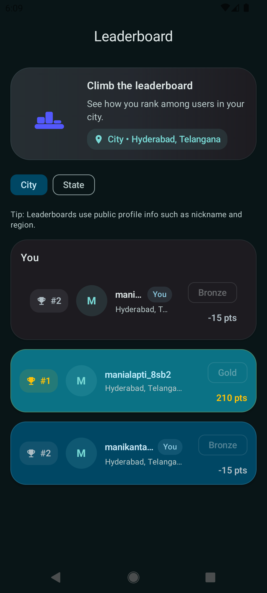
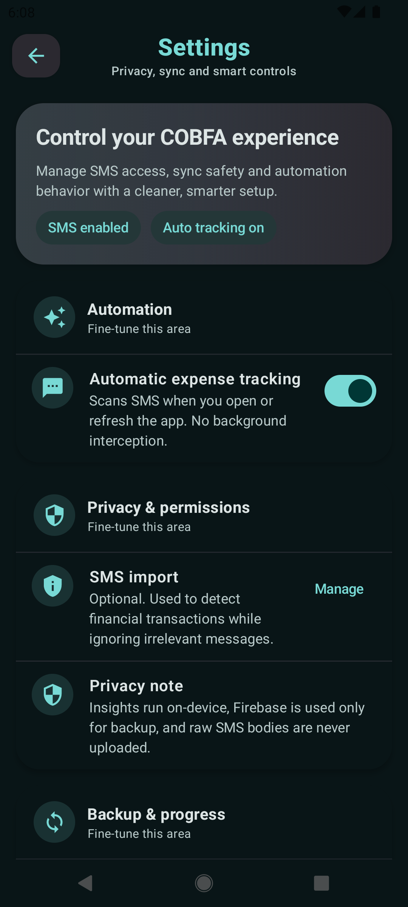
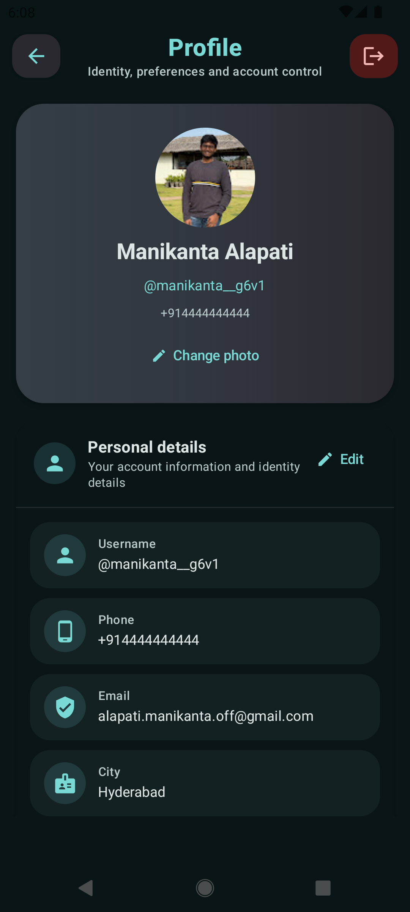
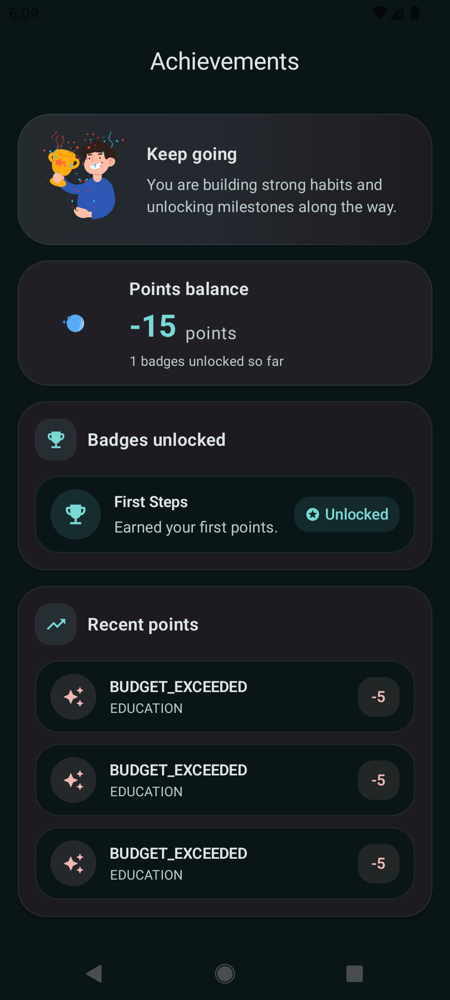

# CoB-FA 💸🧠

<p align="center">
  
</p>

<p align="center">
  <b>AI-powered personal finance tracking with behavioral insights, local-first privacy, and smart expense automation.</b>
</p>

---

## ✨ Overview

**CoB-FA** (**Cognitive Behavioral Financial Advisor**) is an Android application built to help users track expenses, understand spending habits, and make more mindful financial decisions.

Unlike traditional finance apps that mainly record transactions and show statistics, CoB-FA goes a step further by combining personal finance management with behavior-aware intelligence. The app is designed to offer personalized insights based on user spending patterns, helping users move toward more disciplined and righteous expenditure.

CoB-FA follows a **local-first** approach for privacy. Sensitive raw data is not directly pushed to the cloud. Instead, the app focuses on storing essential parsed transaction information and important user details when sync is needed.

---

## 🚀 Features

- **Personalized financial insights** based on individual spending behavior.
- **Expense tracking and management** for everyday financial monitoring.
- **Monthly budget planning** and budget utilization tracking.
- **Analytics dashboard** for visual understanding of expenses and trends.
- **Optional automatic expense tracking** using SMS-based transaction detection.
- **Local-first data handling** for stronger privacy.
- **Cloud sync support** using Firebase for important structured data and continuity.
- **Gamification features** such as achievements and leaderboard.
- **Profile, settings, and account insights** for a complete user experience.
- **Modern UI** built completely with Jetpack Compose and Material 3.

---

## 🧠 Why CoB-FA?

CoB-FA is built around the idea that financial improvement comes not only from recording expenses, but from understanding spending behavior.

The app aims to:
- help users identify their financial patterns,
- encourage thoughtful and controlled spending,
- provide a smarter and more personal finance experience,
- improve insight quality over time as the app learns from individual usage.

This makes CoB-FA more than a basic expense tracker — it acts as a personal financial companion that grows more useful with regular use.

---

## 🔒 Privacy-first approach

Privacy is one of the core design principles of CoB-FA.

- SMS-based tracking is **optional**.
- Raw SMS bodies are **not directly stored in the cloud**.
- Parsed and essential financial information is used where needed.
- Firebase is used for important synced data and account continuity.
- The app follows a **local-first** approach wherever possible.

This allows users to benefit from automation and insights while still keeping control over sensitive financial information.

---

## 📱 Core modules

The application includes the following major areas:

- Dashboard
- Budgets
- Analytics
- Expenses
- Achievements
- Leaderboard
- Profile
- Settings
- Account Insights

---

## 🛠 Tech stack

- **Kotlin**
- **Jetpack Compose**
- **Material 3**
- **Firebase Authentication**
- **Firebase Realtime Database / Firebase services**
- **Room Database**
- **Navigation Compose**
- **WorkManager**
- **MVVM architecture**
- **SMS permission handling and parsing**

---

## 🎨 UI and design

CoB-FA is designed with a modern Android UI approach using **Jetpack Compose** and **Material 3**.

Design highlights include:
- polished custom theming,
- expressive top app bars and bottom navigation,
- premium cards and profile layouts,
- leaderboard and achievements with engaging visuals,
- branding aligned with the CoB-FA identity.

---

## 📷 Screenshots

<p align="center">
  
  
</p>

<p align="center">
  
  
</p>

<p align="center">
  
  
</p>

<p align="center">
  
  
</p>

---

## 📦 Installation

### For end users

If an APK is available in the repository releases:

1. Download the latest APK from the **Releases** section.
2. Transfer it to your Android device if needed.
3. Allow installation from unknown sources if prompted.
4. Install the APK.
5. Open the app and set up your account.

### For developers

1. Clone the repository:

   ```bash
   git clone https://github.com/MANI000PROF/CoB-FA.git
2. Open the project in Android Studio.
3. Make sure you have:
  - Android Studio installed
  - Android SDK configured
  - Gradle synced properly
  - Kotlin support enabled
4. Add your Firebase configuration file:
  - Place google-services.json inside the app/ module.
5. Build and run the project on an emulator or Android device.

---

## ⚙️ Configuration notes

Before running the project locally, make sure:
  - Firebase is configured properly.
  - google-services.json is added to the app module.
  - Required permissions are declared and tested correctly.
  - SMS-related features are used only with explicit user permission.
  - Release builds are signed properly if distributing APKs.

---

## 🏗 Project structure

A simplified project layout:

```text
app/
└── src/main/java/com/cobfa/app
    ├── auth
    ├── data
    ├── navigation
    ├── ui
    │   ├── analytics
    │   ├── budget
    │   ├── dashboard
    │   ├── expense
    │   ├── profile
    │   ├── settings
    │   └── theme
    ├── utils
    └── MainActivity.kt
```
---

## 🌱 Future scope

Possible future enhancements include:
  - stronger ML-driven personalization,
  - spending prediction and smarter recommendations,
  - exportable financial summaries,
  - deeper financial coaching workflows,
  - Play Store deployment,
  - more production-level hardening and testing.

---

## 📚 Project status

This project is currently in a completed academic project stage with continuous refinements and regular updates pushed to the repository.

---

## 🤝 Contributing

This repository is currently maintained as a personal academic and portfolio project. Suggestions, improvements, and constructive feedback are welcome.

---

## 📄 License

This project currently does not have a license attached.

If you want others to legally use, modify, or distribute this project, adding a license such as MIT or Apache-2.0 is recommended.

---

## 👨‍💻 Author

### Manikanta Alapati
Android Developer | Kotlin | Jetpack Compose | FinTech-focused project work

---

## ⭐ Support

If you find this project interesting or helpful:
  - Give it a star.
  - Share feedback.
  - Use it as inspiration for Android finance app development.
